## 简介
EasyBoot单模块仓库

一个使用SpringBoot+MyBatis-Plus+Mysql+Lombok的可快速启动的后台管理框架，
内置自研代码生成器，可一键生成前端Vue页面、后端CRUD和导入导出接口、动态菜单以及数据字典SQL语句等一条龙代码，
可免费用于商业。
项目容易上手，功能丰富，完全开源，一切只为让你的开发更简单

## 分支介绍
master：主分支，v2分支的稳定版本将会推送到主分支

v2：SpringBoot2+Java8版本，开发分支，不保证稳定性

v3：SpringBoot3+Java17版本，开发分支，不保证稳定性

该仓库为单模块版本，多模块版本仓库[点这里](https://github.com/Zoe-Z1/Easy-Boot-Multi-Module)

## 快速体验
[演示地址](https://www.easyboot.cn) 游客账号：visitor 密码：visitor

## 相关项目
单模块后端项目[EasyBoot](https://github.com/Zoe-Z1/EasyBoot)

多模块后端项目[Easy-Boot-Multi-Module](https://github.com/Zoe-Z1/Easy-Boot-Multi-Module)

Vue2+Vite3+Element前端项目[Easy-Admin-Vue2](https://gitee.com/yunzhongshan/Easy-vue2-vite3)

## 如何启动
1.安装Mysql8.0

2.安装Redis

3.使用IDEA打开项目，下载依赖

4.IDEA插件市场中搜索lombok安装并重启IDEA

5.修改[application-dev.yml](https://github.com/Zoe-Z1/EasyBoot/blob/master/src/main/resources/application-dev.yml)中的mysql连接配置和redis连接配置

6.启动后端项目

7.启动前端项目

8.打开浏览器地址：http://localhost:9100

使用 账号：admin 密码：123456 访问系统

如果使用的是windows系统，还需要将[application-dev.yml](https://github.com/Zoe-Z1/EasyBoot/blob/master/src/main/resources/application-dev.yml)中的file-path配置和image-path配置修改为本地磁盘文件夹路径

## 已有功能
<ul>
    <li>动态验证码登录</li>
    <li>首页</li>
    <li>个人中心</li>
    <li>用户管理</li>
    <li>角色管理</li>
    <li>菜单管理</li>
    <li>部门管理</li>
    <li>岗位管理</li>
    <li>字典管理</li>
    <li>配置管理</li>
    <li>模板管理</li>
    <li>公告管理</li>
    <li>在线用户</li>
    <li>定时任务</li>
    <li>服务器监控</li>
    <li>Redis监控</li>
    <li>黑名单管理</li>
    <li>登录日志</li>
    <li>操作日志</li>
    <li>调度日志</li>
    <li>代码生成</li>
    <li>接口文档</li>

</ul>

## 后续规划
<ul>
    <li>更多功能尽请期待......</li>
</ul>

## 交流群
QQ群号：657214683

## 页面展示

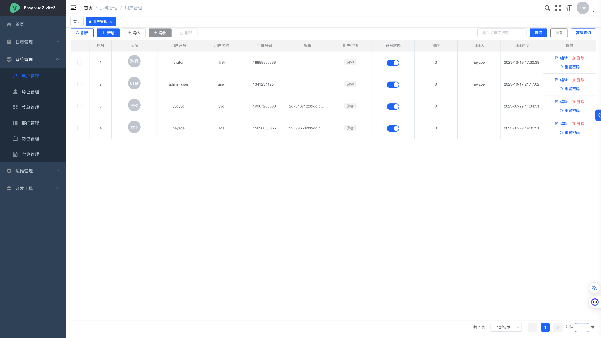
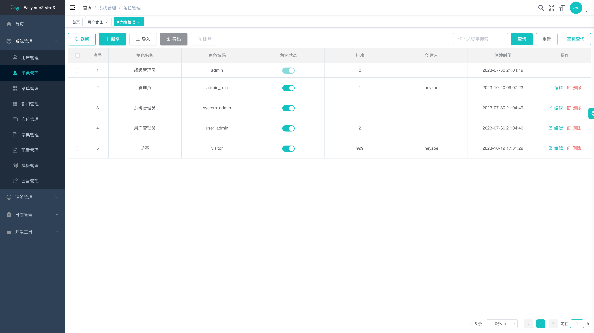
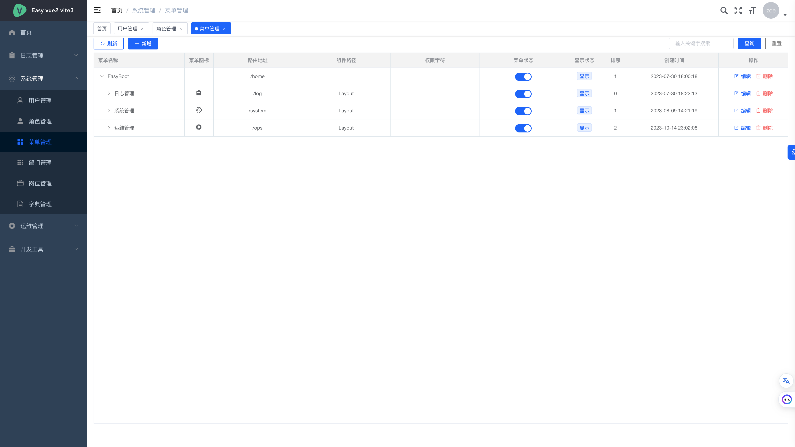
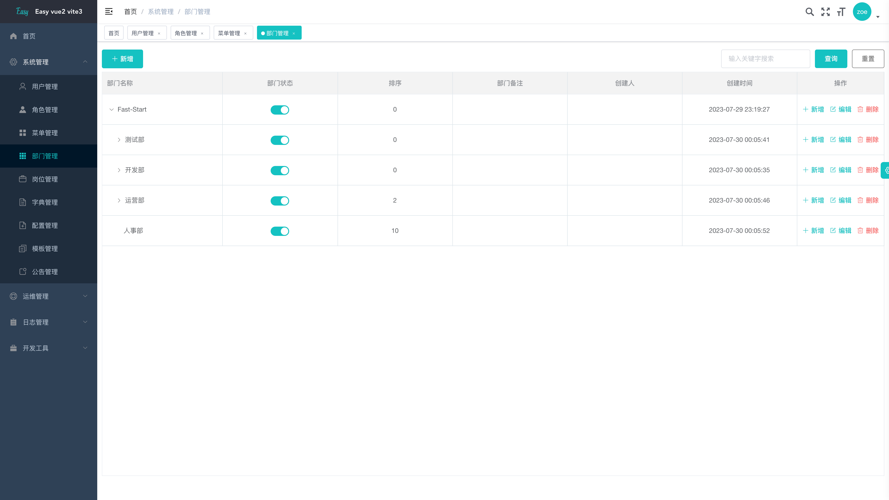
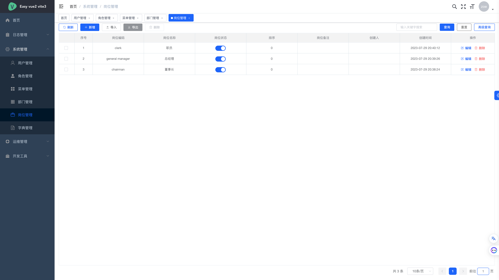
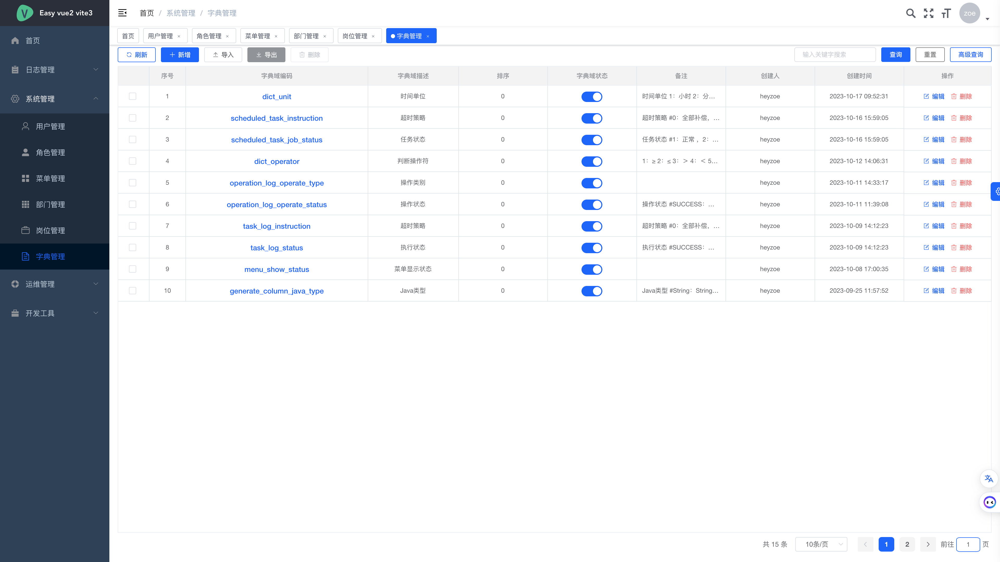
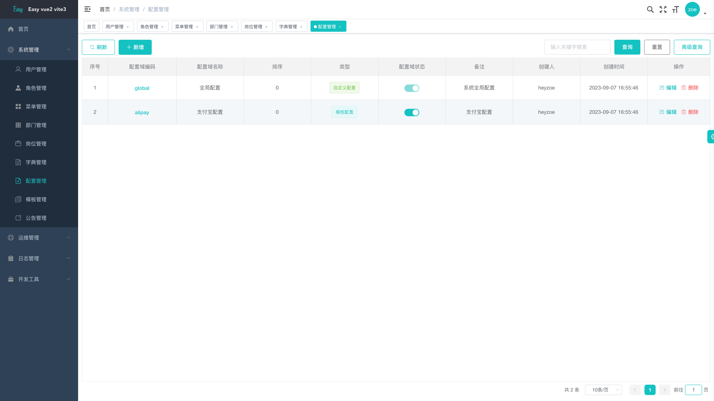
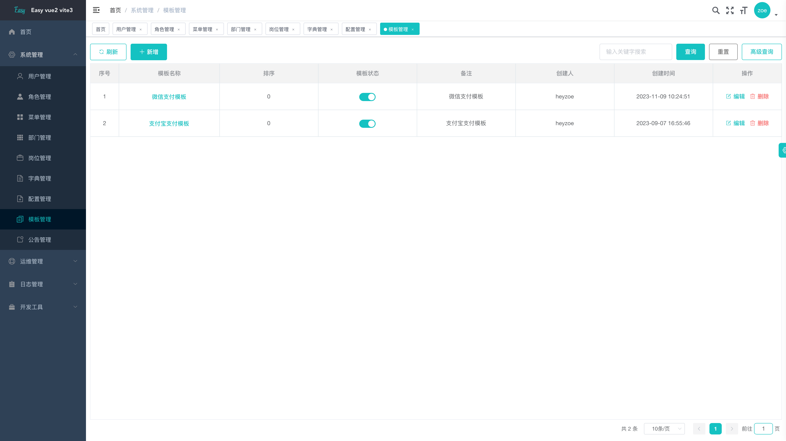
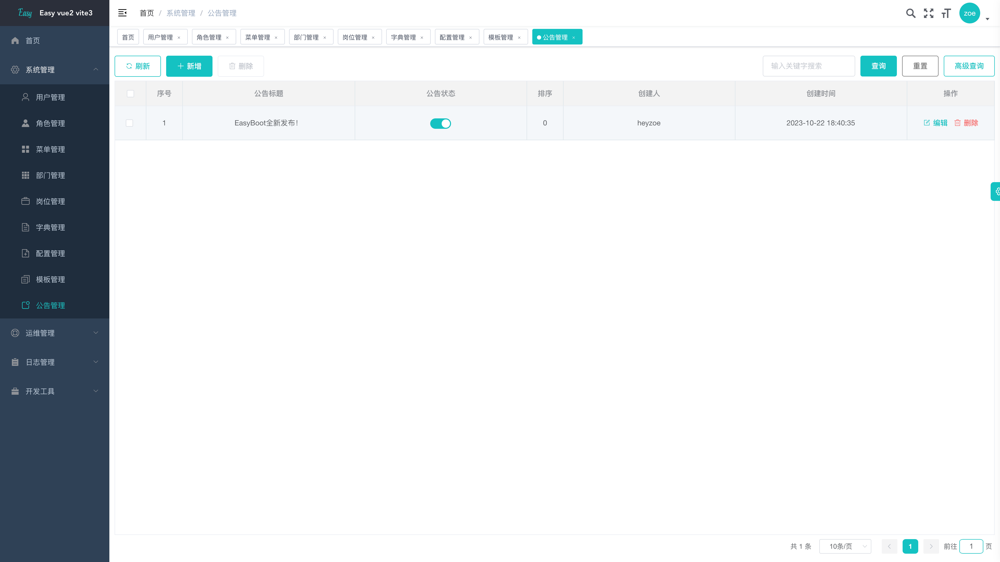
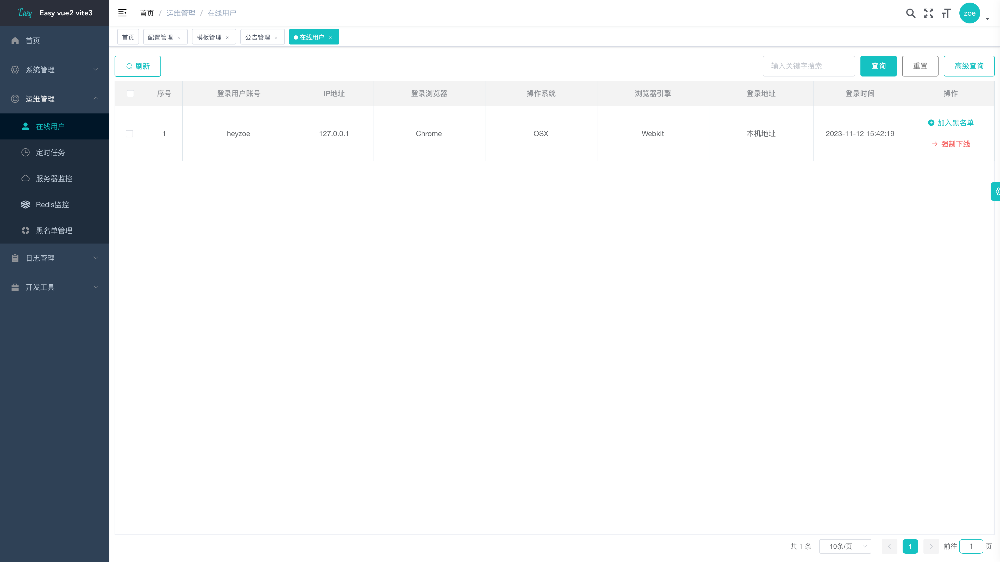
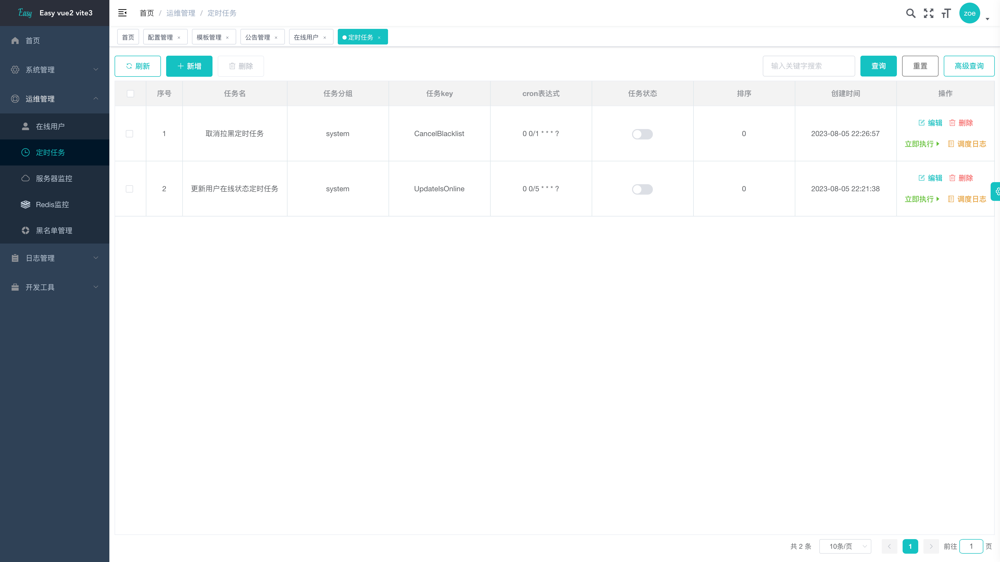

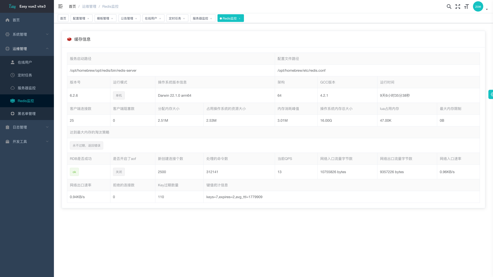
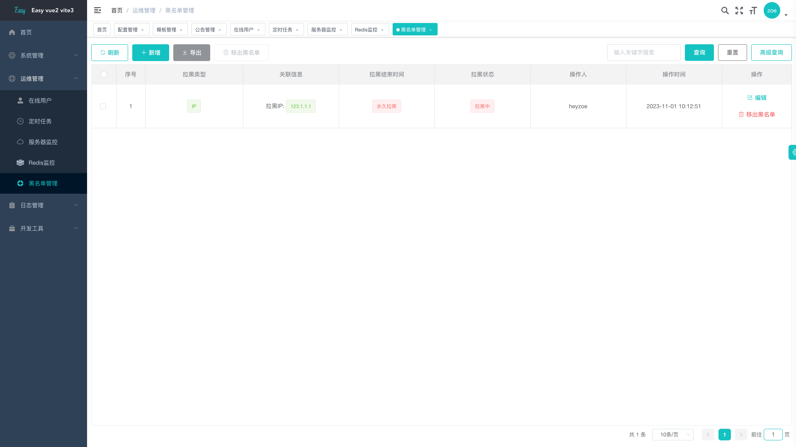
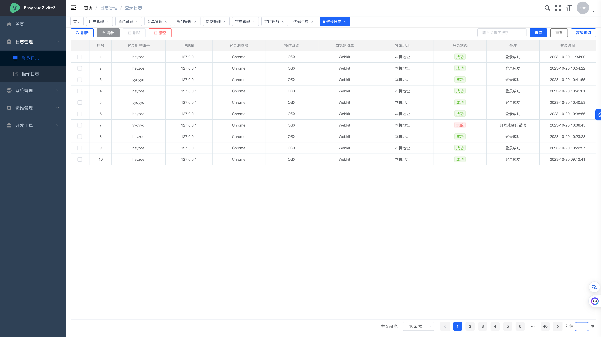
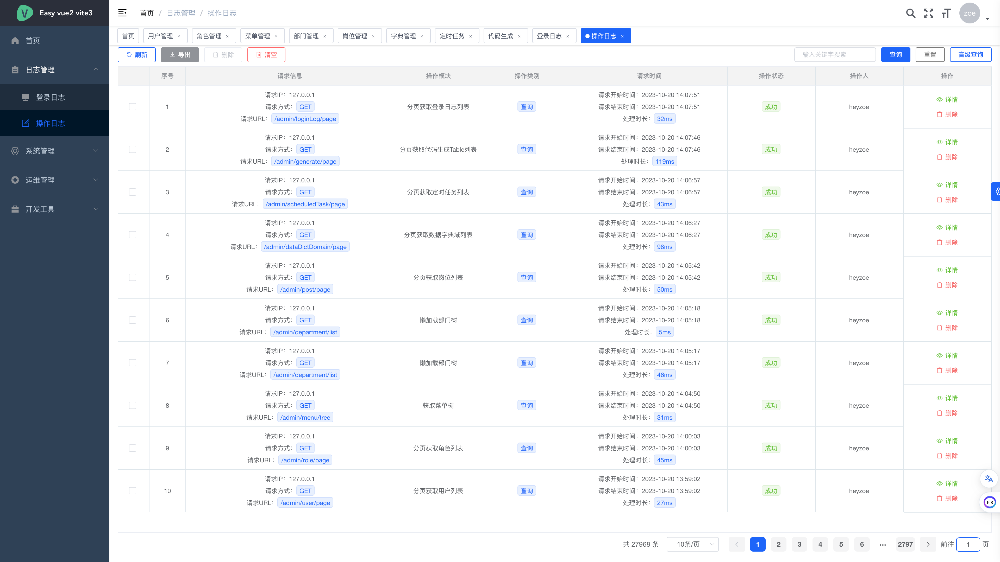
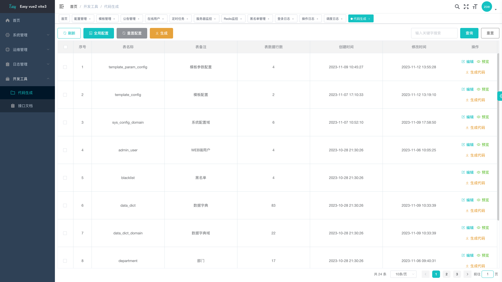

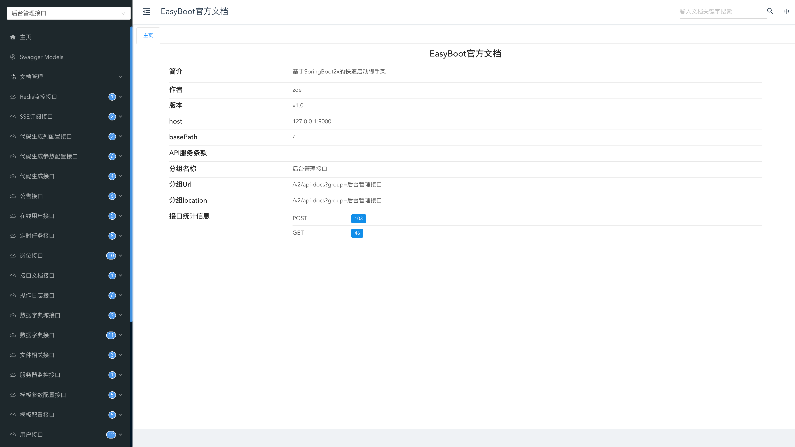

## 鸣谢
感谢[JetBrains](https://jb.gg/OpenSourceSupport)提供的开源许可证

